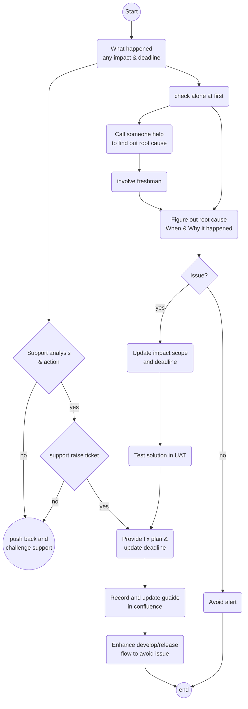

Rule of Supporting
==============================
Mindset
------
1. Accept that your productivity will be killed for the week
2. Stay focused on the suport chat and your emails
3. Keep you are reachable and respond to support ASAP 
4. Notify support when you will be away for a long time or find a backup
5. Communicate using compliant tool

Flow
----
![[Flow to resolve Prod Issue.excalidraw]]

